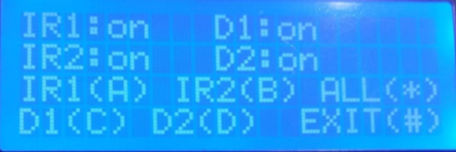

# security-system VF BGAS || Belarusain state academy of communication, Viciebsk department
Code for the arduino. Manages and controls 4 sensors with activating sound alarm using buzzer and providing GUI on the 20x4 LCD.
4x4 Keypad is used for controls. 
# Sensors
> 2 IR motion sensors (IR1,IR2)
> 2 Magnet door sensors (D1,D2)
# Features
To enter the control screen you have to enter 4-digit PIN. You may change PIN at the start screen. 
After entering PIN main control screen opens, where you can activate/diactivate each sensor individually or all together.  
Control tips are displayed for each sensor.  
After setting up the sensors you can press "#" to exit to start screen.  
When one of the sensors gets triggred it activates sound alarm using. Each triggered sensor will be displayed on the screen.  
The only way to stop the alarm is to enter the PIN.
# Pictures
Main control screen  

